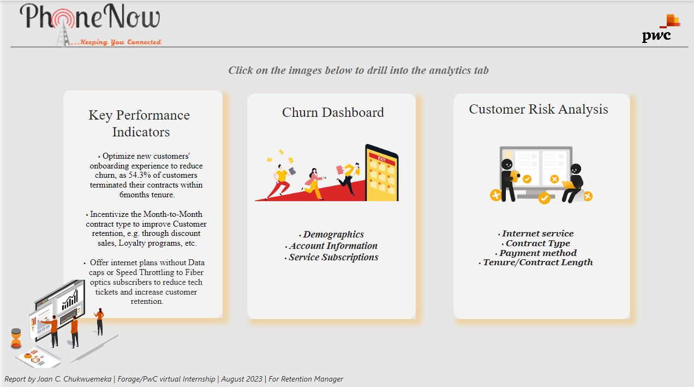

# PwC Switzerland Power BI Virtual Case Experience (2/3) – Customer Retention


## Background
Customers in the telecom industry are hard-earned, and like the Retention Manager from our telecom Client, no brand wants to lose them. A few weeks after presenting the [Call Center Trends](https://github.com/Analyst-Joan/Call-center-Trends) dashboard to the management, the Retention Manager from the telecom reached out directly to Analyst-Joan. He was impressed by the work and asked for a dashboard about customer retention.

Additionally, the telecom Retention Manager scheduled a meeting with the engagement partner at PwC to better understand the data. Some points covered in the meeting include:
1.	The need for proactive steps in customer retention - The retention department is here to get customers back in case of termination. Currently, they get in touch after they have terminated the contract, but this is reactionary, and it will be better to know in advance who is at risk.
2.	Prior Analysis carried out in Excel always resulted in a dead-end.
3.	The need for more In-depth analysis of the telecom’s customers, via self-explanatory, clear visuals for presentation to the management team.
The retention manager also provided more context to the required dashboard through the email shown below

 
## About the Data
The dataset is a Microsoft Excel file that contains one table, consisting of **7,043 rows and 23 columns** of **PhoneNow Telecoms** customer information, which includes, customer Demographics, Account Information, and Service Subscriptions. The data was gotten from [Forage]( https://cdn.theforage.com/vinternships/companyassets/4sLyCPgmsy8DA6Dh3/02%20Churn-Dataset.xlsx).   

## Client’s Need 
A Power BI dashboard that reflects all relevant Key Performance Indicators (KPIs) and metrics in the dataset, Insights (findings) and recommendations (suggestions as to what needs to be changed).

## Target Audience
-	Janet, The Retention Manager at PhoneNow Telecoms.
-	The Engagement Partner at PwC
-	Management Team at PhoneNow

## Skills/Concepts applied
-	Defining KPIs
-	Cleaning/Validation in Power Query
-	Power BI DAX Concepts: Calculated Measures
-	Data Visualization in Power BI
-	Power BI Dashboard building
-	Filters and Slicers.
-	Insights & Actions

## Data Transformation/Preprocessing
The dataset was imported into Power BI’s Power Query for data validation and cleaning.  The column profiling was changed from ‘based on Top 1000 rows’ to ‘based on entire dataset’. ‘Column quality’ and ‘Column distribution’ checkboxes were selected to get a summary information about each column for effective cleaning/Preprocessing. The process is as outlined below:
-	Column datatypes were validated appropriately.
-	The **senior citizen** status of customers in the `senior citizen` column was changed from numeric 	representation to text for clarity i.e., “0” replaced with “No” and “1” replaced with “Yes”.
  
## Data Modelling
_This was not applicable as the dataset has only one table._ However, a **measures table** was created to store calculated measures for Enhanced reusability, Improved data model organization and Increased performance.


 
## Data Exploration / KPI Visualization.
With the data now processed, it’s time to explore the data. We’ll analyze relevant KPIs, which will include data-driven insights that are critical to the organization's success, visualize findings, and show customers at risk. 

### Analyzing Customer Churn
I started with analyzing metrics that show Customer churn based on demographics, Account information, and Service subscriptions. We’ll first look at total customers, their demographics, how long they’ve been PhoneNow customers (Tenure), and how many of them left (Churn). Taking a count of the `customers IDs` column and the count of those whose status in the `Churn` column is “yes”, we see that there are **7,043** customers, out of which **1,869** left the business. The following measures were also created to analyze the metrics:

```
Churned Customers = CALCULATE(
                           COUNT(Churn_Dataset[Churn]),	
                                  Churn_Dataset[Churn]= "Yes")
```
```
Senior Citizens = DIVIDE(
                        CALCULATE(
                                COUNT(Churn_Dataset[SeniorCitizen]),
                                      Churn_Dataset[SeniorCitizen] = "Yes"),
                        COUNT(Churn_Dataset[customerID]))
```
```
Partner = DIVIDE(
                CALCULATE(
                         COUNT(Churn_Dataset[Partner]),
                               Churn_Dataset[Partner] ="Yes"),
                COUNT(Churn_Dataset[customerID]))
```
```
Dependents = DIVIDE(
                   CALCULATE(
                            COUNT(Churn_Dataset[Dependents]), 
                                  Churn_Dataset[Dependents] = "Yes"), 
                  COUNT(Churn_Dataset[customerID]))
```
To analyze the customer tenure, **Binning** was used to group customers by 6 months period.
The measures were then used with relevant records in the dataset to visualize the metrics as shown below:
 


From the above visual, 49.8% of the churned customers were females while 50.2% were males, with the churn rate being highest among customers with partners (35.8%), and least among those having dependents (17.4%). It also shows that customers who have been with the business between 6 -12months had the highest churn, with average tenure being about 1year & 5months.

Next, we’ll look at the account information of churned customers, considering how much they are charged, their payment/billing method, their contract type as well as the Customer Lifetime Value (CLV), which is the estimated value of a customer over the entire duration of their relationship with the company, and helps in understanding the long-term profitability of a customer. The DAX measure below was used to compute the CLV:
```
Customer Lifetime Value (CLV) = AVERAGE(Churn_Dataset[MonthlyCharges]) * 
                                                AVERAGE(Churn_Dataset[tenure])
```
The measure was then used alongside other relevant records to visualize the metrics as shown below:

  
From the above visual, we see the highest churn rate among customers who operate monthly contracts, those who receive paperless billing, and those that make payments via electronic check. It also shows that the company loses about $1,338.39, the estimated average monetary value per churned customers.

Moving on, we will now assess the service subscriptions of the **PhoneNow** churned customers. The following measures were computed to analyze the metrics, and afterwards used alongside other relevant records to visualize them.

**Calculated Measures:**
```
Phone Service(Yes) = DIVIDE(
                           CALCULATE(
                                   COUNT(Churn_Dataset[PhoneService]),
                                         Churn_Dataset[PhoneService] = Yes"), 
                           COUNT(Churn_Dataset[customerID]))
```
```
Streaming Movies= DIVIDE(
                        CALCULATE(
                                COUNT(Churn_Dataset[StreamingMovies]),
                                      Churn_Dataset[StreamingMovies]= Yes"), 
                       COUNT(Churn_Dataset[customerID]))
```
```
Streaming TV= DIVIDE(
                    CALCULATE(
                             COUNT(Churn_Dataset[StreamingTV]),
                                   Churn_Dataset[StreamingTV] = Yes"), 
                   COUNT(Churn_Dataset[customerID]))
```
```
Online Backup = DIVIDE(
                     CALCULATE(
                              COUNT(Churn_Dataset[OnlineBackup]),
                                    Churn_Dataset[OnlineBackup] = Yes"), 
                     COUNT(Churn_Dataset[customerID]))
```
```
Online Security = DIVIDE(
                        CALCULATE(
                                COUNT(Churn_Dataset[OnlineSecurity]),
                                      Churn_Dataset[OnlineSecurity] = Yes"), 
                       COUNT(Churn_Dataset[customerID]))
```
```
Device Protection = DIVIDE(
                          CALCULATE(
                                   COUNT(Churn_Dataset[DeviceProtection]),
                                         Churn_Dataset[DeviceProtection] = Yes"), 
                          COUNT(Churn_Dataset[customerID]))
```
```
Tech Support = DIVIDE(
                     CALCULATE(
                              COUNT(Churn_Dataset[TechSupport]),
                                    Churn_Dataset[TechSupport] = Yes"), 
                     COUNT(Churn_Dataset[customerID]))
```

 


The Visual above shows that customers subscribed to phone services had a very high churn rate of 90.9%, followed by Fiber optic internet service subscribers (69.4%). With the least being subscribers with no internet service subscription. What could be the challenge(s) with the phone and fiber optic internet service of PhoneNow Telecoms? 🤔🤔🤔 The management team will need to investigate this.

### Churn Dashboard

Having analyzed metrics for customer churn, the visuals were then brought into a single page view in the dashboard shown below as requested.
 


From the Churn analysis, the **Potential risk areas** Identified include:
- Length of time the customer(s) have been with PhoneNow telecoms (Tenure).
- Type of contract
- Payment method
- Type of Internet service
These will be analyzed further with the aim to uncover possible reasons for the high churn.

### Customer Risk Analysis
Based on the insights derived from analyzing the Churn rate across different levels, further analysis was then carried out, to drill down and assess possible reasons for the high churn rate, within the categories of customers, seen to be at higher risk for churn. This will help the retention manager and the management team make proactive, data-driven decisions that will improve Customer retention. 
Firstly, a DAX measure was computed for churn rate as shown below. 

```
Churn Rate = DIVIDE(_Measures[Churned Customers],COUNT(Churn_Dataset[customerID]))
```
The measure was then used to visualise `Internet service`, `Contract Type`, `Payment method`, and `Tenure (Contract Length)` where applicable, along with other metrics, to build the **Customer Risk Analysis dashboard** shown below.

 
 

The visual above shows that Fiber optic internet service subscribers, those on monthly contract, and those that make payments via electronic check have higher monthly charges among other groups in their respective categories. It also shows that **monthly charges decreased as customer tenure increases**, that is, new customers get to be charged higher. This is likely one of the reasons why customers churn within a year and should be addressed. 

## Recommendations to drive Performance (KPI):
1.	Optimize new customers' onboarding experience to reduce churn, as 54.3% of customers terminated their contracts within 6months tenure.

    **_Potential KPIs:_**
- _Churn Rate:_ Measure the percentage of customers who terminate their contracts within 6 months. This is a direct KPI that aligns with the goal of reducing churn.
- _Onboarding Satisfaction Score:_ Implement surveys or feedback mechanisms to measure customer satisfaction with the onboarding process. This can be tracked over time to ensure improvements.


2.	Incentivize the Month-to-Month contract type to improve Customer retention, e.g., through discount sales, Loyalty programs, etc.

    **Potential KPIs:**
- _Percentage of Monthly Contracts:_ Track the proportion of new contracts that are of the month-to-month type. 	This can help gauge the effectiveness of incentives in promoting this contract type.

- _Customer Retention Rate for Monthly Contracts:_ Measure how many month-to-month customers continue their subscriptions over time. This directly assesses the impact of incentives on retention.

3.	Offer internet plans without Data caps or Speed Throttling to Fiber optics subscribers to reduce tech tickets and increase customer retention.

    **Potential KPIs:**
- _Tech Ticket Reduction:_ Track the number of technical support tickets raised by Fiber optics subscribers before and after the removal of data caps or speed throttling. A reduction in tickets indicates improved service quality.

- _Fiber Optics Customer Retention Rate:_ Monitor the percentage of Fiber optics subscribers who remain with the service after the introduction of unlimited plans. This measures the impact on customer retention.

4.	Target values should be assigned for each KPI, in order to measure success more effectively.

These potential KPIs are aligned with the retention Manager’s objectives and can help her be proactive in driving customer retention.

## Conclusion
The KPIs should be tracked over time and used to guide decision-making and performance improvement efforts. 

Here is the [interactive Dashboards](https://drive.google.com/file/d/13sbP8_0BKpj8quYXlyudNlGRcVHeLEE1/view?usp=sharing) designed to provide flexibility for The Engagement Partner at PwC and Janet, The Retention Manager at PhoneNow Telecoms, to enable querying of varying metrics and in-depth discourse of the findings with the management team.

Thank you.

